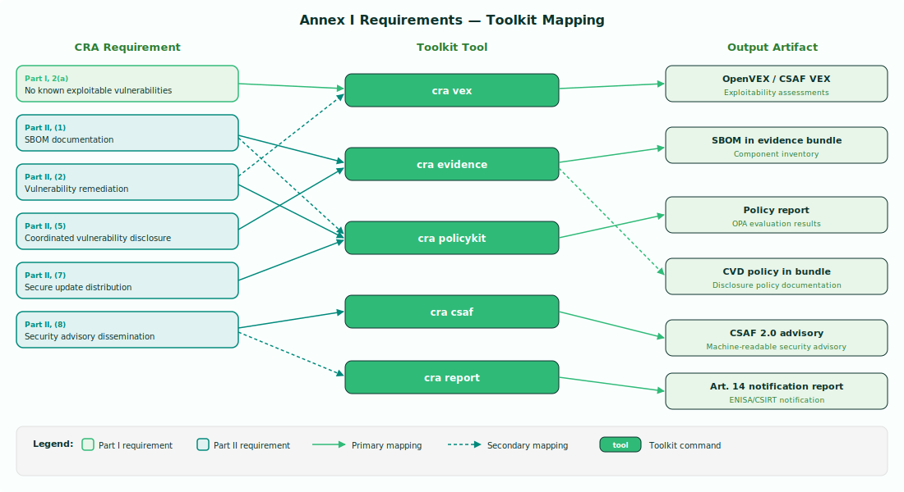

# Annex I — Essential Cybersecurity Requirements

Annex I of Regulation (EU) 2024/2847 (the Cyber Resilience Act) sets out the **essential cybersecurity requirements** that all products with digital elements must meet before being placed on the EU market. It is divided into two parts:

- **Part I** covers requirements relating to the **properties of products with digital elements** — what the product itself must achieve in terms of security.
- **Part II** covers **vulnerability handling requirements** imposed on manufacturers — the processes and practices manufacturers must maintain throughout the product's support period.

Together, these requirements form the baseline against which conformity is assessed. Non-compliance with these essential requirements can result in penalties of up to **EUR 15 million or 2.5% of annual worldwide turnover**, whichever is higher.

## Toolkit Mapping

The following diagram shows how Annex I requirements map to toolkit commands and their output artifacts:

---

## Part I — Cybersecurity Requirements Relating to the Properties of Products with Digital Elements

### General obligation

**(1)** Products with digital elements shall be designed, developed and produced in such a way that they ensure an appropriate level of cybersecurity based on the risks.

### Specific requirements

**(2)** On the basis of the cybersecurity risk assessment referred to in Article 13(2) and where applicable, products with digital elements shall meet the requirements set out in points (a) to (m) below.

| Ref | Requirement | Description | Toolkit Support | Artifact |
|-----|-------------|-------------|-----------------|----------|
| **2(a)** | No known exploitable vulnerabilities | Products shall be made available on the market without any known exploitable vulnerabilities. Manufacturers must exercise due diligence to identify and address vulnerabilities before market placement. | `cra vex` determines exploitability status for each vulnerability; `cra policykit` checks against the KEV catalog (policy CRA-AI-2.1) | OpenVEX document, Policy report |
| **2(b)** | Secure by default configuration | Products shall be made available with a secure by default configuration, including the possibility to reset the product to its original state. Default settings shall minimise exposure to risk. | Manual assessment required | Risk assessment documentation |
| **2(c)** | Security updates | Vulnerabilities shall be addressed through security updates, made available without delay. Where technically feasible, security updates shall be provided automatically, with a clear opt-out mechanism for the user. Updates shall be provided separately from functionality updates. | `cra policykit` evaluates update mechanism compliance (policy CRA-AI-4.2) | Policy report |
| **2(d)** | Protection from unauthorised access | Products shall protect from unauthorised access through appropriate control mechanisms, including authentication, identity management, or access control systems. | Manual assessment required | Architecture documentation |
| **2(e)** | Confidentiality of data | Products shall protect the confidentiality of stored, transmitted, and otherwise processed data — whether personal or other — through appropriate means such as state-of-the-art encryption of data at rest and in transit. | Manual assessment required | Architecture documentation |
| **2(f)** | Integrity of data | Products shall protect the integrity of stored, transmitted, and otherwise processed data — whether personal or other — against unauthorised manipulation or modification. They shall ensure the authenticity and integrity of software. | Manual assessment required | Architecture documentation |
| **2(g)** | Data minimisation | Products shall process only data — whether personal or other — that is adequate, relevant, and limited to what is necessary for the intended use of the product (data minimisation principle). | Manual assessment required | Architecture documentation |
| **2(h)** | Availability and resilience | Products shall protect the availability of essential and basic functions, including the resilience against and mitigation of denial-of-service attacks. Products shall maintain appropriate levels of availability even under stress conditions. | Manual assessment required | Architecture documentation |
| **2(i)** | Minimise impact on other services | Products shall minimise their own negative impact on the availability of services provided by other devices or networks. This includes limiting the potential for a compromised product to be weaponised against third-party infrastructure. | Manual assessment required | Architecture documentation |
| **2(j)** | Limit attack surfaces | Products shall be designed, developed, and produced to limit attack surfaces, including external interfaces. Attack surfaces shall be reduced to the minimum necessary for the product to function. | Manual assessment required | Architecture documentation |
| **2(k)** | Exploitation mitigation | Products shall be designed, developed, and produced with appropriate exploitation mitigation mechanisms and techniques to reduce the impact of potential security incidents. | Manual assessment required | Architecture documentation |
| **2(l)** | Security monitoring and logging | Products shall provide security-related information by recording and/or monitoring relevant internal activity, including access to or modification of data, services, or functions. Logging capabilities shall be proportionate to the intended use. | Manual assessment required | Architecture documentation |
| **2(m)** | Secure data removal | Products shall provide the possibility for users to securely and easily remove all data and settings on a permanent basis, and where such data can be transferred to other products or systems, to ensure this is done in a secure manner. | Manual assessment required | Architecture documentation |

!!! tip "Toolkit Implementation"
    The `cra vex` tool automates the assessment required by **Part I, point 2(a)** by determining exploitability status for each vulnerability found by scanners. The `cra policykit` tool evaluates update mechanism compliance for **point 2(c)**.
    See [VEX — Vulnerability Exploitability eXchange](../tools/vex.md) and [PolicyKit — Policy Evaluation](../tools/policykit.md).

---

## Part II — Vulnerability Handling Requirements

Manufacturers of products with digital elements shall comply with the following vulnerability handling requirements throughout the support period of the product:

| Ref | Requirement | Description | Toolkit Support | Artifact |
|-----|-------------|-------------|-----------------|----------|
| **(1)** | Identify and document vulnerabilities and components (SBOM) | Manufacturers shall identify and document vulnerabilities and components contained in the product, including by drawing up a software bill of materials (SBOM) in a commonly used and machine-readable format covering at least the top-level dependencies of the product. | `cra policykit` validates SBOM presence and format (policy CRA-AI-1.1); `cra evidence` bundles the SBOM into the compliance evidence package | SBOM, Policy report |
| **(2)** | Address and remediate vulnerabilities without delay | Manufacturers shall address and remediate vulnerabilities without delay, including by providing security updates. Where possible, security updates shall be provided separately from functionality updates. Remediation shall include regular testing and review. | `cra vex` produces exploitability assessments; `cra policykit` validates remediation processes | VEX document, Policy report |
| **(3)** | Apply effective and regular security testing | Manufacturers shall apply effective and regular tests and reviews of the security of the product with digital elements. This includes testing for known vulnerabilities and conducting security assessments appropriate to the risk. | Manual assessment required | Test reports, security review documentation |
| **(4)** | Publicly disclose fixed vulnerabilities | Upon making a security update available, manufacturers shall publicly disclose information about fixed vulnerabilities, including a description of the vulnerability, information allowing users to identify the affected product, the impacts of the vulnerability, the severity, and clear information to help users remediate. | `cra csaf` generates CSAF 2.0 advisories with structured vulnerability descriptions, impact statements, and remediation guidance | CSAF 2.0 advisory |
| **(5)** | Coordinated vulnerability disclosure policy | Manufacturers shall put in place and enforce a policy on coordinated vulnerability disclosure, including a contact address for vulnerability reporting. The policy shall provide for a process for handling and remediating reported vulnerabilities in a timely manner. | `cra evidence` bundles the CVD policy document into the compliance evidence package | CVD policy in evidence bundle |
| **(6)** | Facilitate vulnerability information sharing | Manufacturers shall facilitate the sharing of information about vulnerabilities in their product and the third-party components contained therein, including by providing a contact address for the reporting of vulnerabilities discovered in the product. | Manual — provide contact address in product documentation | Product documentation |
| **(7)** | Secure mechanisms for update distribution | Manufacturers shall provide mechanisms to securely distribute updates for products with digital elements to ensure that exploitable vulnerabilities are fixed or mitigated in a timely manner. Where applicable, updates shall be distributed automatically with a clear opt-out mechanism. | `cra policykit` evaluates update distribution mechanism compliance (policy CRA-AI-4.2) | Policy report |
| **(8)** | Security update dissemination with advisory | Manufacturers shall ensure that, where security updates are available to address identified security issues, they are disseminated without delay and free of charge, accompanied by advisory messages providing users with relevant information including on potential action to be taken. | `cra csaf` generates machine-readable CSAF 2.0 advisories; `cra report` produces Art. 14 notification reports for ENISA/CSIRT submission | CSAF 2.0 advisory, Art. 14 notification report |

!!! tip "Toolkit Implementation"
    The vulnerability handling requirements in Part II are the most extensively automated by the toolkit:

    - **Requirement (1):** Use `cra evidence` to bundle SBOMs and `cra policykit` to validate them. See [Evidence — Compliance Bundling](../tools/evidence.md).
    - **Requirement (2):** Use `cra vex` for exploitability assessment. See [VEX — Vulnerability Exploitability eXchange](../tools/vex.md).
    - **Requirement (4) and (8):** Use `cra csaf` to generate advisories. See [CSAF — Security Advisory Generation](../tools/csaf.md).
    - **Requirement (5):** Use `cra evidence` to bundle your CVD policy. See [Evidence — Compliance Bundling](../tools/evidence.md).
    - **Requirement (7):** Use `cra policykit` to validate update mechanisms. See [PolicyKit — Policy Evaluation](../tools/policykit.md).

!!! info "Manual Assessment Requirements"
    Many Part I requirements (2(b) through 2(m)) and Part II requirement (3) require **manual assessment** specific to each product's architecture and design. The toolkit focuses on automating the requirements that can be addressed through standardised machine-readable formats (VEX, SBOM, CSAF) and policy evaluation. For guidance on documenting manual assessments, see [Annex VII — Technical Documentation](annex-vii.md).

---

## Cross-references

- **Article 13(2)** — Cybersecurity risk assessment that determines which of the point (2) requirements apply
- **Article 14** — [Vulnerability notification obligations](article-14.md) (triggered by Part II vulnerability handling)
- **Annex VII** — [Technical documentation requirements](annex-vii.md) (evidence of Annex I compliance)
- **Annex VIII** — Conformity assessment procedures for verifying compliance with Annex I
