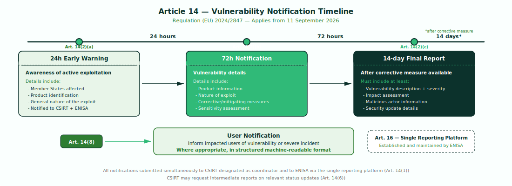

# Article 14 - Vulnerability Reporting Obligations

## The Obligation

**Art. 14(1):** A manufacturer shall notify any actively exploited vulnerability contained in the product with digital elements that it becomes aware of simultaneously to the CSIRT designated as coordinator and to ENISA, via the single reporting platform established pursuant to Article 16.

!!! warning "Applies from: 11 September 2026"
    Article 14 reporting obligations enter into force ahead of the full CRA application date of 11 December 2027. Manufacturers must be prepared to comply with the notification timeline from **11 September 2026**.

---

## Three-Stage Notification Timeline

<figure markdown="span">
  { width="100%" }
  <figcaption>The three notification stages required by Article 14 of Regulation (EU) 2024/2847.</figcaption>
</figure>

### 24-hour Early Warning - Art. 14(2)(a)

An early warning notification of an actively exploited vulnerability, without undue delay and in any event within 24 hours of the manufacturer becoming aware of it, indicating, where applicable, the Member States on the territory of which the manufacturer is aware that their product with digital elements has been made available.

### 72-hour Notification - Art. 14(2)(b)

Unless the relevant information has already been provided, a vulnerability notification, without undue delay and in any event within 72 hours of the manufacturer becoming aware of the actively exploited vulnerability, which shall provide general information, as available, about the product with digital elements concerned, the general nature of the exploit and of the vulnerability concerned as well as any corrective or mitigating measures taken, and corrective or mitigating measures that users can take, and which shall also indicate, where applicable, how sensitive the manufacturer considers the notified information to be.

### 14-day Final Report - Art. 14(2)(c)

Unless the relevant information has already been provided, a final report, no later than 14 days after a corrective or mitigating measure is available, including at least:

1. a description of the vulnerability, including its severity and impact;
2. where available, information concerning any malicious actor that has exploited or that is exploiting the vulnerability;
3. details about the security update or other corrective measures that have been made available to remedy the vulnerability.

---

## Severe Incidents - Art. 14(3-5)

Manufacturers must also notify any severe incident having an impact on the security of the product. An incident is considered severe where:

**(a)** it negatively affects or is capable of negatively affecting the availability, authenticity, integrity or confidentiality of sensitive or important data or functions; or

**(b)** it has led or is capable of leading to the introduction or execution of malicious code.

---

## User Notification - Art. 14(8)

After becoming aware of an actively exploited vulnerability or a severe incident, the manufacturer shall inform the impacted users of the product with digital elements, and where appropriate all users, of that vulnerability or incident and, where necessary, of any risk mitigation and corrective measures that the users can deploy to mitigate the impact. Where appropriate, notification shall be in a structured, machine-readable format that is easily automatically processable.

---

## Single Reporting Platform - Art. 16

ENISA establishes and maintains the single reporting platform for all Article 14 notifications. CSIRTs designated as coordinators disseminate notifications to affected Member States.

---

## Intermediate Reports - Art. 14(6)

Where necessary, the CSIRT designated as coordinator may request manufacturers to provide intermediate reports on relevant status updates.

---

!!! tip "Toolkit Implementation"
    The `cra report` tool generates all three notification stages automatically from your SBOM, scan results, and VEX assessments.
    See [Report - Article 14 Notification Generator](../tools/report.md).

    The `cra csaf` tool produces the structured, machine-readable advisories required by Art. 14(8).
    See [CSAF - Advisory Generation](../tools/csaf.md).
