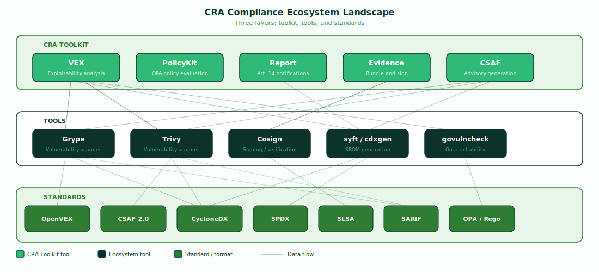

# The CRA Compliance Landscape

The CRA toolkit doesn't replace existing security tools — it orchestrates them into a compliance pipeline. Vulnerability scanners, SBOM generators, signing tools, and policy engines each handle a specific concern. The toolkit integrates their outputs into a unified workflow that satisfies CRA obligations.

---

## Three-Layer Architecture

### CRA Toolkit Layer

The top layer contains the five core tools that implement CRA compliance logic:

- **[VEX](../tools/vex.md)** — determines vulnerability exploitability through a six-stage filter chain, producing VEX statements that communicate whether each vulnerability is applicable to your specific product.
- **[PolicyKit](../tools/policykit.md)** — evaluates compliance against CRA requirements using embedded OPA/Rego policies, producing structured pass/fail/warn results for each Annex I requirement.
- **[Report](../tools/report.md)** — generates Article 14 vulnerability notifications for CSIRT/ENISA submission, with all required fields and appropriate timing metadata.
- **[Evidence](../tools/evidence.md)** — bundles all compliance artifacts (SBOM, VEX, scan results, policy results, advisories) into a signed, timestamped evidence package for conformity assessment.
- **[CSAF](../tools/csaf.md)** — converts scan results and VEX assessments into CSAF 2.0 security advisories for downstream user communication.

These tools consume outputs from the layers below and produce CRA-specific compliance artifacts.

### Tools Layer

The middle layer contains the ecosystem tools that generate the raw security data the toolkit consumes:

- **[Grype](scanners.md#grype)** and **[Trivy](scanners.md#trivy)** — vulnerability scanners that identify known CVEs in container images, filesystems, and SBOMs.
- **[Cosign](infrastructure.md#cosign)** — signs and verifies evidence bundles using Sigstore's keyless infrastructure or local keys.
- **[syft / cdxgen](scanners.md)** — SBOM generators that produce CycloneDX or SPDX bills of materials from source code, container images, and package manifests.
- **[govulncheck](scanners.md)** — Go-specific vulnerability scanner with built-in reachability analysis.

These tools are not part of the CRA toolkit itself. You install and run them independently — the toolkit consumes their output files.

### Standards Layer

The bottom layer contains the data formats and standards that define interoperability:

- **[OpenVEX](standards.md#openvex)** — vulnerability exploitability exchange format, the default output of `cra vex`.
- **[CSAF 2.0](standards.md#csaf-20)** — machine-readable security advisory format, the output of `cra csaf`.
- **[CycloneDX](standards.md#cyclonedx)** and **[SPDX](standards.md#spdx)** — SBOM formats accepted as input across all toolkit tools.
- **[SLSA](standards.md#slsa)** — supply chain provenance attestation format evaluated by `cra policykit`.
- **[SARIF](standards.md#sarif)** — static analysis results format accepted as scan input.
- **[OPA / Rego](standards.md#opa-rego)** — policy language powering the PolicyKit evaluation engine.

All formats are JSON-based and auto-detected by the toolkit — no format flags needed.

---

## Next Steps

- **[Standards & Formats](standards.md)** — detailed reference for each standard, its CRA relevance, and how the toolkit uses it.
- **[Vulnerability Scanners](scanners.md)** — setup guides and compatible output commands for each supported scanner.
- **[Infrastructure Components](infrastructure.md)** — OPA, Cosign, and tree-sitter integration details.
