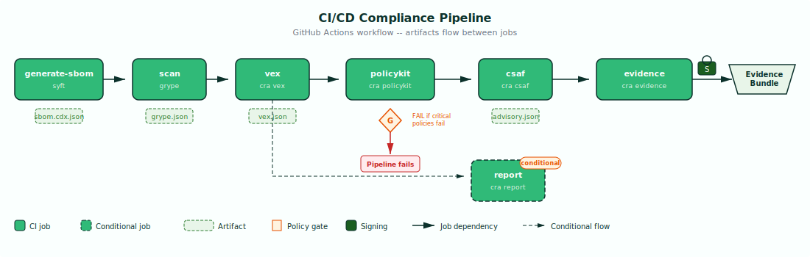

# CI/CD Integration

Embed CRA compliance checks into your CI/CD pipeline to automate compliance artifact generation on every build or release. By integrating the toolkit into continuous integration, you ensure that every change is evaluated against CRA requirements before it reaches production.

## Pipeline Overview

The following diagram shows the complete CI/CD compliance pipeline as a sequence of jobs, with artifacts flowing between them:



The pipeline runs seven jobs in sequence. The **policykit** job acts as a quality gate -- if critical CRA policies fail, the pipeline stops. The **report** job is conditional, executing only when actively exploited vulnerabilities are detected. The **evidence** job runs last, consuming all upstream artifacts and producing a signed evidence bundle.

---

## GitHub Actions Reference Pipeline

The following workflow provides a complete, production-ready GitHub Actions configuration for CRA compliance automation.

Create `.github/workflows/cra-compliance.yml`:

```yaml
name: CRA Compliance

on:
  push:
    branches: [main]
  pull_request:
    branches: [main]
  schedule:
    - cron: '0 6 * * 1'

jobs:
  generate-sbom:
    runs-on: ubuntu-latest
    steps:
      - uses: actions/checkout@v4
      - name: Install syft
        uses: anchore/sbom-action/download-syft@v0
      - name: Generate SBOM
        run: syft . -o cyclonedx-json > sbom.cdx.json
      - uses: actions/upload-artifact@v4
        with:
          name: sbom
          path: sbom.cdx.json

  scan:
    needs: generate-sbom
    runs-on: ubuntu-latest
    steps:
      - uses: actions/download-artifact@v4
        with: { name: sbom }
      - name: Install Grype
        uses: anchore/scan-action/download-grype@v4
      - name: Scan SBOM
        run: grype sbom:sbom.cdx.json -o json > grype.json
      - uses: actions/upload-artifact@v4
        with:
          name: scan
          path: grype.json

  vex:
    needs: scan
    runs-on: ubuntu-latest
    steps:
      - uses: actions/checkout@v4
      - uses: actions/download-artifact@v4
        with: { name: sbom }
      - uses: actions/download-artifact@v4
        with: { name: scan }
      - name: Install CRA toolkit
        run: go install github.com/ravan/suse-cra-toolkit/cmd/cra@latest
      - name: VEX determination
        run: cra vex --sbom sbom.cdx.json --scan grype.json --source-dir . -o vex.json
      - uses: actions/upload-artifact@v4
        with:
          name: vex
          path: vex.json

  policykit:
    needs: vex
    runs-on: ubuntu-latest
    steps:
      - uses: actions/download-artifact@v4
        with: { name: sbom }
      - uses: actions/download-artifact@v4
        with: { name: scan }
      - uses: actions/download-artifact@v4
        with: { name: vex }
      - name: Install CRA toolkit
        run: go install github.com/ravan/suse-cra-toolkit/cmd/cra@latest
      - name: Evaluate policies
        run: |
          cra policykit --sbom sbom.cdx.json --scan grype.json --vex vex.json \
            --product-config product.yaml -o policy-report.json
      - uses: actions/upload-artifact@v4
        with:
          name: policy-report
          path: policy-report.json

  csaf:
    needs: vex
    runs-on: ubuntu-latest
    steps:
      - uses: actions/download-artifact@v4
        with: { name: sbom }
      - uses: actions/download-artifact@v4
        with: { name: scan }
      - uses: actions/download-artifact@v4
        with: { name: vex }
      - name: Install CRA toolkit
        run: go install github.com/ravan/suse-cra-toolkit/cmd/cra@latest
      - name: Generate CSAF advisory
        run: |
          cra csaf --sbom sbom.cdx.json --scan grype.json --vex vex.json \
            --publisher-name "${{ vars.PUBLISHER_NAME }}" \
            --publisher-namespace "${{ vars.PUBLISHER_NAMESPACE }}" \
            -o advisory.json
      - uses: actions/upload-artifact@v4
        with:
          name: csaf
          path: advisory.json

  evidence:
    needs: [policykit, csaf]
    runs-on: ubuntu-latest
    steps:
      - uses: actions/download-artifact@v4
      - name: Install CRA toolkit
        run: go install github.com/ravan/suse-cra-toolkit/cmd/cra@latest
      - name: Bundle evidence
        run: |
          cra evidence --product-config product.yaml --output-dir ./evidence \
            --sbom sbom/sbom.cdx.json --vex vex/vex.json \
            --scan scan/grype.json --policy-report policy-report/policy-report.json \
            --csaf csaf/advisory.json --archive
      - uses: actions/upload-artifact@v4
        with:
          name: evidence-bundle
          path: ./evidence/
```

---

## Key Design Decisions

**Policy gate stops the pipeline on critical failures.** The PolicyKit job fails the pipeline if critical policies (CRA-AI-1.1, CRA-AI-2.1) report FAIL. This prevents non-compliant artifacts from progressing to the evidence bundling stage.

**Report job is conditional.** Notification generation under Article 14 is only required when actively exploited vulnerabilities are detected. In most pipeline runs, this job will be skipped. Add it as needed based on VEX output analysis.

**Evidence job runs last, consuming all upstream artifacts.** The evidence bundle requires outputs from every previous stage. The `needs: [policykit, csaf]` dependency ensures both parallel branches complete before bundling begins.

**Weekly scheduled runs ensure ongoing compliance.** The `schedule` trigger runs the pipeline every Monday at 06:00 UTC. Vulnerability databases are updated continuously -- a component that was clean last week may have new CVEs this week.

**Repository variables for publisher metadata.** Use `vars.PUBLISHER_NAME` and `vars.PUBLISHER_NAMESPACE` rather than hardcoding publisher information. Configure these under Settings > Secrets and variables > Actions > Variables.

---

## Conceptual Pipeline Mapping

The reference pipeline is written for GitHub Actions, but the same structure maps to other CI/CD platforms:

| Stage | GitHub Actions | GitLab CI | Tekton |
|---|---|---|---|
| SBOM generation | `actions/checkout` + syft | `stage: sbom` + syft | `Task: generate-sbom` |
| Vulnerability scan | grype action | `stage: scan` + grype | `Task: scan` |
| VEX determination | `cra vex` step | `stage: vex` | `Task: vex` |
| Policy evaluation | `cra policykit` step | `stage: policy` | `Task: policykit` |
| Advisory generation | `cra csaf` step | `stage: csaf` | `Task: csaf` |
| Evidence bundling | `cra evidence` step | `stage: evidence` | `Task: evidence` |
| Artifact passing | `upload/download-artifact` | `artifacts:` / `dependencies:` | PVC / workspace |
| Failure gating | `needs:` + exit code | `allow_failure: false` | `runAfter:` + condition |

Regardless of the CI/CD platform, the core pattern is the same: each stage produces an artifact that the next stage consumes, with the policy evaluation acting as a gate that can halt the pipeline.
