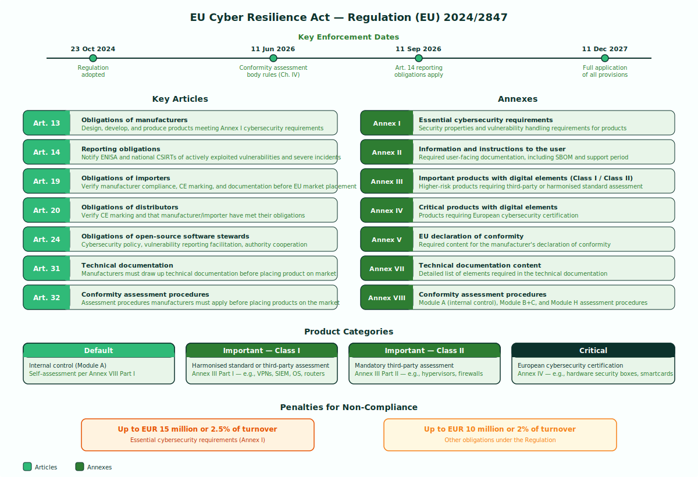
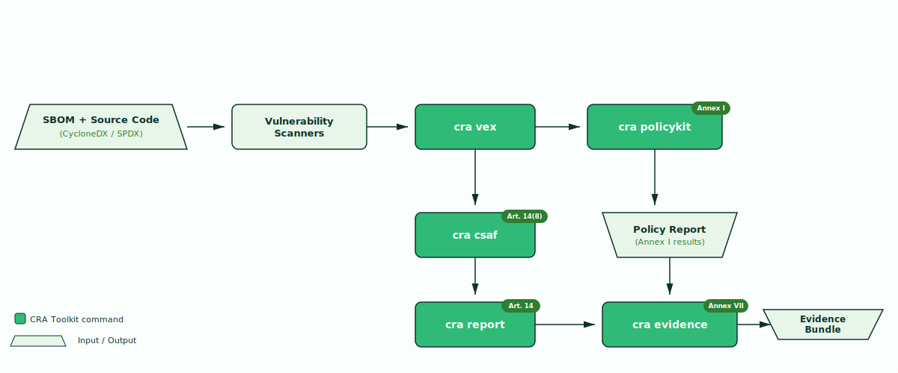

# CRA Compliance Toolkit

**You ship software in the EU. The Cyber Resilience Act changes everything.**

Regulation (EU) 2024/2847, the **Cyber Resilience Act (CRA)**, introduces mandatory cybersecurity requirements for all products with digital elements placed on the EU market. It applies to manufacturers, importers, and distributors alike. Enforcement of vulnerability reporting obligations begins **11 September 2026**, with full application of all requirements from **11 December 2027**.

Non-compliance carries administrative fines of up to EUR 15 million or 2.5% of global annual turnover. The clock is running.

---

## What you need to do

The CRA imposes concrete, auditable obligations on software manufacturers:

- **Maintain a Software Bill of Materials** for every product (Annex I, Part II, point 1)
- **Assess and document all known vulnerabilities** before placing a product on the market (Annex I, Part I, point 2(a))
- **Notify ENISA and national CSIRTs** of actively exploited vulnerabilities within 24 hours (Article 14)
- **Provide security advisories** to downstream users in a structured, machine-readable format (Article 14(8))
- **Bundle technical documentation** for conformity assessment (Annex VII)

!!! warning "Not optional"
    These are legal requirements, not best practices. Every product with digital elements, from container images to firmware, must comply.

The CRA introduces obligations across the entire product lifecycle:



---

## How this toolkit helps

The CRA Compliance Toolkit automates the technical obligations of the CRA through five composable CLI tools:

| Tool | What it does | CRA Mapping |
|------|-------------|-------------|
| [**VEX**](tools/vex.md) | Auto-determine vulnerability exploitability using a deterministic filter chain | Annex I |
| [**PolicyKit**](tools/policykit.md) | Evaluate CRA compliance policies using embedded OPA/Rego rules | Annex I |
| [**Report**](tools/report.md) | Generate Article 14 vulnerability notification documents | Article 14 |
| [**Evidence**](tools/evidence.md) | Bundle and sign compliance outputs into a versioned evidence package | Annex VII |
| [**CSAF**](tools/csaf.md) | Convert scanner output and VEX results into CSAF 2.0 advisories | Article 14(8) |

Each tool reads standard inputs (CycloneDX SBOMs, scanner JSON, OpenVEX) and produces standard outputs. No vendor lock-in, no proprietary formats.

---

## Pipeline

The tools compose into an end-to-end compliance pipeline:



Vulnerability scanners consume your SBOM and source code to produce findings. `cra vex` applies reachability analysis and deterministic triage. `cra policykit` evaluates compliance against Annex I requirements. The results flow into `cra csaf` for machine-readable advisories, `cra report` for Article 14 notifications, and `cra evidence` to bundle everything for conformity assessment.

---

## Quick start

```bash
# Install
go install github.com/ravan/cra-toolkit/cmd/cra@latest

# Run VEX determination
cra vex --sbom sbom.cdx.json --scan grype.json -o vex.json

# Evaluate compliance policies
cra policykit --sbom sbom.cdx.json --scan grype.json --vex vex.json

# Generate Article 14 early warning
cra report --sbom sbom.cdx.json --scan grype.json \
  --stage early-warning --product-config product.yaml

# Generate CSAF advisory
cra csaf --sbom sbom.cdx.json --scan grype.json \
  --publisher-name "My Company" --publisher-namespace "https://example.com"

# Bundle evidence
cra evidence --product-config product.yaml --output-dir ./evidence \
  --sbom sbom.cdx.json --vex vex.json --scan grype.json --archive
```

!!! tip "Full walkthrough"
    See the [End-to-End Workflow](guides/workflow.md) guide for a complete example using a real open-source project.
