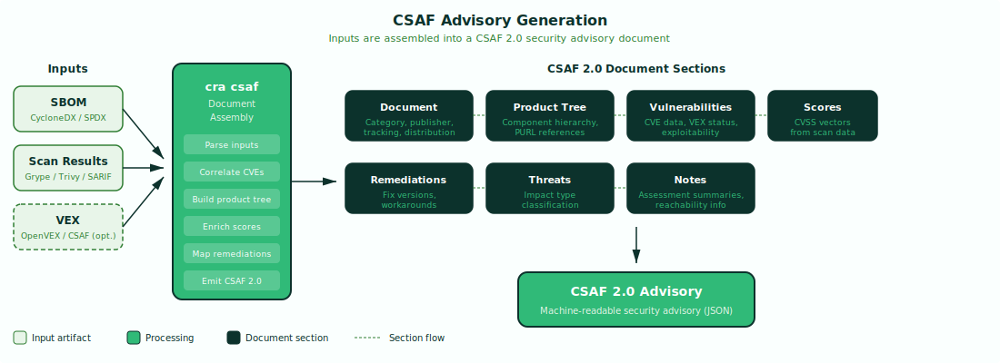

# CSAF — Advisory Generation

`cra csaf` converts vulnerability scanner output and VEX assessments into CSAF 2.0 (Common Security Advisory Framework) security advisories — the industry-standard machine-readable format for vulnerability communication to downstream users.

!!! abstract "CRA Reference"
    This tool addresses **Article 14(8)**: after becoming aware of an actively exploited
    vulnerability, the manufacturer shall inform impacted users in a structured,
    machine-readable format that is easily automatically processable.
    See [Article 14 — Vulnerability Notification](../cra/article-14.md).

    It also supports **Annex I, Part II, point (8)**: security updates shall be
    accompanied by advisory messages providing users with relevant information.
    See [Annex I — Essential Requirements](../cra/annex-i.md).

---

## How It Works



The `cra csaf` command takes an SBOM, one or more vulnerability scan results, and an optional VEX document as input. It parses each input, correlates CVE findings with SBOM components, and assembles a complete CSAF 2.0 advisory document. The resulting advisory is a single JSON file containing all the information a downstream consumer needs to understand and act on the disclosed vulnerabilities.

### CSAF Document Anatomy

A CSAF 2.0 advisory is composed of several interrelated sections:

#### Document

Top-level metadata about the advisory itself. Includes the advisory category (typically `csaf_security_advisory`), publisher identity (organization name and namespace), tracking information (ID, version, initial and current release dates, revision history), and distribution/TLP markings. This metadata enables automated advisory aggregation and lifecycle management.

#### Product Tree

A hierarchical representation of the products and components affected by the advisory, derived from the SBOM. Each component is identified by its PURL (Package URL), establishing precise traceability between the advisory and the software bill of materials. The product tree enables consumers to automatically match advisories against their own deployed inventories.

#### Vulnerabilities

The core of the advisory — one entry per CVE found in the scan results. Each vulnerability entry includes the CVE identifier, title, and discovery date. When a VEX document is provided, findings are enriched with exploitability status (affected, not affected, under investigation), giving consumers actionable context beyond the raw CVE data.

#### Scores

CVSS scoring vectors extracted from the scan data. Each vulnerability's score is associated with the specific product(s) it affects, enabling consumers to prioritize remediation based on severity in the context of their environment.

#### Remediations

Remediation guidance for each vulnerability. Includes fix versions where a patched release is available, workarounds for vulnerabilities without patches, and vendor fix commitments with timelines. Each remediation is tied to specific products from the product tree.

#### Threats

Threat classification for each vulnerability, describing the type of impact (such as exploitation status or impact characterization). This section provides consumers with threat intelligence context to inform their response prioritization.

#### Notes

Supplementary information including assessment summaries, reachability analysis details (when VEX input includes call path evidence), and general advisory commentary. Notes provide human-readable context that complements the machine-readable structured data.

---

## Usage

```bash
cra csaf --sbom <path> --scan <path> --publisher-name <name> --publisher-namespace <url> [flags]
```

### Flags

| Flag | Description | Required | Default |
|---|---|---|---|
| `--sbom` | Path to SBOM file (CycloneDX or SPDX) | Yes | — |
| `--scan` | Path to scan results (Grype, Trivy, or SARIF); repeatable | Yes | — |
| `--publisher-name` | Organization name for the advisory publisher | Yes | — |
| `--publisher-namespace` | Organization URL for the advisory publisher | Yes | — |
| `--vex` | Path to VEX results (OpenVEX or CSAF VEX) | No | — |
| `--tracking-id` | Advisory tracking ID (auto-generated if omitted) | No | auto |
| `--title` | Advisory title (auto-generated if omitted) | No | auto |
| `--output`, `-o` | Output file path | No | stdout |

---

## Input Formats

All input formats are auto-detected by probing JSON structure — no format flags needed.

- **SBOM:** CycloneDX (JSON), SPDX (JSON)
- **Scans:** Grype (JSON), Trivy (JSON), SARIF
- **VEX:** OpenVEX (JSON), CSAF (JSON)

---

## Examples

### Basic advisory

```bash
cra csaf --sbom sbom.cdx.json --scan grype.json \
  --publisher-name "ACME Corp" --publisher-namespace "https://acme.example.com" \
  -o advisory.json
```

Generates a CSAF 2.0 advisory from the SBOM and Grype scan results. The advisory includes all vulnerabilities found in the scan, with product tree entries derived from the SBOM components. Publisher metadata is set to the specified organization. The tracking ID and title are auto-generated.

### VEX-enriched advisory

```bash
cra csaf --sbom sbom.cdx.json --scan grype.json --vex vex.json \
  --publisher-name "ACME Corp" --publisher-namespace "https://acme.example.com" \
  --tracking-id "ACME-2026-001" --title "Security Advisory for Product X" \
  -o advisory.json
```

Enriches the advisory with VEX exploitability assessments. Vulnerabilities that have been assessed as `not_affected` in the VEX document are reflected in the advisory with their justifications. The custom tracking ID and title provide stable identifiers for advisory lifecycle management — updates to the same advisory reuse the tracking ID with an incremented version.

---

## Integration

CSAF output feeds into `cra evidence` as a signed artifact in the compliance bundle. Use alongside `cra report` for complete Article 14 compliance — Report generates CSIRT/ENISA notifications, while CSAF produces downstream user advisories. Together, they cover both regulatory notification obligations and user communication requirements.

- **`cra evidence`** — includes the CSAF advisory in the signed evidence bundle for conformity assessment. See [Evidence — Bundling & Signing](evidence.md).
- **`cra report`** — generates Article 14 notifications for CSIRT/ENISA. See [Report — Article 14 Notifications](report.md).
- **`cra vex`** — produces VEX documents that enrich CSAF advisories with exploitability context. See [VEX — Vulnerability Exploitability eXchange](vex.md).
