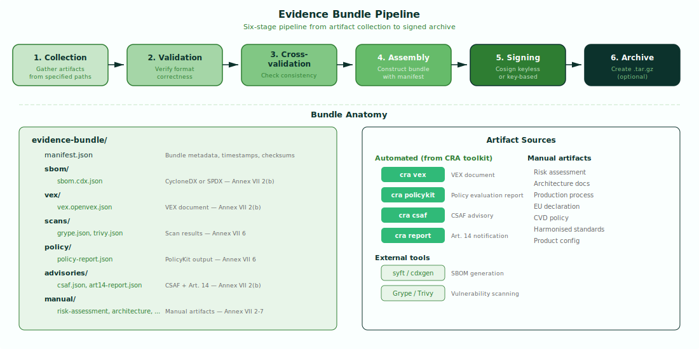

# Evidence — Bundling & Signing

`cra evidence` bundles and signs compliance outputs into a versioned CRA evidence package for Annex VII technical documentation and conformity assessment. It collects artifacts from all other tools in the pipeline — plus manually authored documents — validates them, and produces a signed, archivable bundle that demonstrates compliance with the EU Cyber Resilience Act.

!!! abstract "CRA Reference"
    This tool addresses **Annex VII** — Content of the Technical Documentation, and
    **Annex V** — EU Declaration of Conformity. It assembles the evidence package
    required for conformity assessment under **Article 32**.
    See [Annex VII — Technical Documentation](../cra/annex-vii.md).

---

## How It Works



The evidence tool runs a six-stage pipeline that takes individual compliance artifacts and produces a signed, versioned bundle ready for conformity assessment.

### Stage 1: Collection

Gathers all artifacts from the paths specified via flags. Each artifact type has a dedicated flag (e.g. `--sbom`, `--vex`, `--scan`). The tool accepts both automated outputs from other CRA toolkit tools and manually authored documents such as risk assessments and architecture documentation.

### Stage 2: Validation

Verifies format correctness for each collected artifact. SBOMs are validated against CycloneDX or SPDX schemas, VEX documents against OpenVEX or CSAF schemas, scan results against Grype, Trivy, or SARIF formats, and policy reports against the PolicyKit output schema. Invalid artifacts are rejected with actionable error messages.

### Stage 3: Cross-validation

Checks consistency between artifacts. For example, SBOM components are matched against VEX subjects to ensure the VEX document covers the same product described in the SBOM. Scan result CVEs are cross-referenced with VEX statements to detect gaps. The product configuration is verified against all artifacts to ensure consistent product identification.

### Stage 4: Assembly

Constructs the bundle directory structure with a `manifest.json` at the root. The manifest contains bundle metadata (product name, version, timestamp), a complete inventory of included artifacts with SHA-256 checksums, and cross-reference validation results. Each artifact is copied into a categorized subdirectory (sbom/, vex/, scans/, policy/, advisories/, manual/).

### Stage 5: Signing

Signs the bundle manifest using Cosign. By default, keyless signing is used via Fulcio (certificate authority) and Rekor (transparency log), which provides a verifiable audit trail without requiring key management. Alternatively, a private key can be provided via `--signing-key` for air-gapped or enterprise environments.

### Stage 6: Archive

Optionally creates a `.tar.gz` archive of the signed bundle when `--archive` is specified. The archive includes the signature and is ready for submission to notified bodies or storage in compliance repositories.

---

## Artifact Inventory

| Artifact | Flag | Source | Annex VII Section |
|---|---|---|---|
| SBOM | `--sbom` | External (syft, cdxgen) | 2(b) |
| VEX document | `--vex` | `cra vex` | 2(b) |
| Scan results | `--scan` | Grype, Trivy, SARIF | 6 |
| Policy report | `--policy-report` | `cra policykit` | 6 |
| CSAF advisory | `--csaf` | `cra csaf` | 2(b) |
| Art. 14 notification | `--art14-report` | `cra report` | 2(b) |
| Risk assessment | `--risk-assessment` | Manual | 3 |
| Architecture docs | `--architecture` | Manual | 2(a) |
| Production process | `--production-process` | Manual | 2(c) |
| EU declaration | `--eu-declaration` | Manual | 7 |
| CVD policy | `--cvd-policy` | Manual | 2(b) |
| Harmonised standards | `--standards` | Manual | 5 |
| Product config | `--product-config` | Manual | 1, 4 |

---

## Usage

```bash
cra evidence --product-config <path> --output-dir <path> [flags]
```

### Flags

| Flag | Description | Required | Default |
|---|---|---|---|
| `--product-config` | Path to product configuration YAML | Yes | — |
| `--output-dir` | Output directory for evidence bundle | Yes | — |
| `--sbom` | Path to SBOM | No | — |
| `--vex` | Path to VEX document | No | — |
| `--scan` | Path to scan results; repeatable | No | — |
| `--policy-report` | Path to PolicyKit report JSON | No | — |
| `--csaf` | Path to CSAF advisory | No | — |
| `--art14-report` | Path to Art. 14 notification JSON | No | — |
| `--risk-assessment` | Path to cybersecurity risk assessment | No | — |
| `--architecture` | Path to architecture document | No | — |
| `--production-process` | Path to production process document | No | — |
| `--eu-declaration` | Path to EU declaration of conformity | No | — |
| `--cvd-policy` | Path to CVD policy | No | — |
| `--standards` | Path to harmonised standards document | No | — |
| `--format` | Output format: `json` or `markdown` | No | `json` |
| `--archive` | Also produce .tar.gz archive | No | `false` |
| `--signing-key` | Cosign key path (keyless if omitted) | No | keyless |

---

## Examples

### Minimal bundle with automated artifacts

```bash
cra evidence --product-config product.yaml --output-dir ./evidence \
  --sbom sbom.cdx.json --vex vex.json --scan grype.json \
  --policy-report policy-report.json
```

Creates an evidence bundle containing the core automated artifacts: SBOM, VEX document, scan results, and policy evaluation report. The bundle is signed keyless via Fulcio/Rekor.

### Full bundle with all artifacts

```bash
cra evidence --product-config product.yaml --output-dir ./evidence \
  --sbom sbom.cdx.json --vex vex.json \
  --scan grype.json --scan trivy.json \
  --policy-report policy-report.json \
  --csaf csaf-advisory.json \
  --art14-report art14-notification.json \
  --risk-assessment risk-assessment.pdf \
  --architecture architecture.pdf \
  --production-process production-process.pdf \
  --eu-declaration eu-declaration.pdf \
  --cvd-policy cvd-policy.md \
  --standards standards-mapping.pdf
```

Creates a comprehensive evidence bundle with all 13 artifact types — both automated outputs and manually authored documents. Cross-validation checks consistency across all artifacts.

### Signed archive for submission

```bash
cra evidence --product-config product.yaml --output-dir ./evidence \
  --sbom sbom.cdx.json --vex vex.json --scan grype.json \
  --policy-report policy-report.json \
  --csaf csaf-advisory.json --art14-report art14-notification.json \
  --risk-assessment risk-assessment.pdf \
  --architecture architecture.pdf \
  --archive --signing-key cosign.key
```

Creates a signed evidence bundle and packages it as a `.tar.gz` archive using a specific Cosign key. The archive is ready for submission to notified bodies or storage in a compliance repository.

---

## Integration

Evidence is the final tool in the CRA compliance pipeline — it consumes outputs from all other tools:

- **`cra vex`** — VEX document providing vulnerability exploitability determinations and reachability evidence. See [VEX — Vulnerability Exploitability eXchange](vex.md).
- **`cra policykit`** — policy evaluation report verifying Annex I compliance. See [PolicyKit — Policy Evaluation Engine](policykit.md).
- **`cra csaf`** — CSAF advisory for structured vulnerability disclosure. See [CSAF — Advisory Generation](csaf.md).
- **`cra report`** — Art. 14 notification documents for vulnerability reporting. See [Report — Article 14 Notifications](report.md).
- **External tools** — SBOMs from syft or cdxgen, scan results from Grype or Trivy.
- **Manual artifacts** — risk assessments, architecture documentation, production process descriptions, EU declarations of conformity, CVD policies, and harmonised standards mappings authored by the product team.
