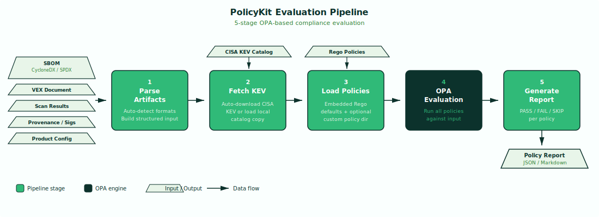

# PolicyKit — Policy Evaluation Engine

`cra policykit` evaluates CRA Annex I compliance policies against product artifacts using embedded OPA (Open Policy Agent) and Rego rules. It provides machine-checkable, auditable compliance verification with clear PASS/FAIL/SKIP results per policy, producing a structured report suitable for conformity assessment documentation.

!!! abstract "CRA Reference"
    This tool evaluates compliance with **Annex I** essential cybersecurity requirements
    and supports **Annex VII** conformity assessment documentation.
    See [Annex I — Essential Requirements](../cra/annex-i.md) and
    [Annex VII — Technical Documentation](../cra/annex-vii.md).

---

## How It Works



PolicyKit runs a 5-stage evaluation pipeline that takes product artifacts as input and produces a structured compliance report. Each stage feeds into the next, building up the context needed for OPA to evaluate all policies.

### Stage 1: Parse Artifacts

All input files are loaded and auto-detected by probing their JSON/YAML structure. The SBOM (CycloneDX or SPDX), VEX document (OpenVEX or CSAF), scan results (Grype, Trivy, or SARIF), provenance attestation, signature files, and product configuration are parsed into a unified structured input document. This normalized representation is what OPA evaluates against.

### Stage 2: Fetch KEV

The CISA Known Exploited Vulnerabilities (KEV) catalog is either auto-downloaded from CISA's public endpoint or loaded from a local file via the `--kev` flag. The KEV catalog is used by the `CRA-AI-2.1` policy to check whether any scan findings appear in the catalog of actively exploited vulnerabilities.

### Stage 3: Load Policies

Built-in Rego policies are loaded from the embedded policy directory. These cover the 10 default compliance rules listed below. If the `--policy-dir` flag is provided, custom Rego policies from that directory are loaded alongside the built-in policies. Custom policies follow the same rule structure and are evaluated in the same pass.

### Stage 4: OPA Evaluation

All loaded policies are evaluated against the structured input using the embedded OPA engine. Each policy produces a result with a `status` (pass, fail, or skip), `severity`, `evidence` explaining the determination, and the `cra_reference` it maps to. Policies that cannot be evaluated due to missing input artifacts produce a `skip` status rather than a false failure.

### Stage 5: Generate Report

Results from all policy evaluations are assembled into an output report in either JSON or Markdown format. The report lists every policy with its rule ID, name, CRA reference, status, severity, and evidence. Summary counts of PASS, FAIL, and SKIP results are included at the top for quick assessment.

---

## Built-in Policies

PolicyKit ships with 10 built-in policies covering CRA Annex I essential requirements, Article 13 obligations, and reachability analysis quality.

| Rule ID | Name | CRA Reference | What It Checks | Severity |
|---|---|---|---|---|
| CRA-AI-1.1 | SBOM exists and is valid | Annex I Part II.1 | SBOM format (CycloneDX/SPDX), metadata (name/version), component count, PURL coverage, supplier info | critical |
| CRA-AI-2.1 | No known exploited vulnerabilities | Annex I Part I.2(a) | Intersection of scan findings CVEs with CISA KEV catalog | critical |
| CRA-AI-2.2 | All critical/high CVEs have VEX assessment | Annex I Part I.2(a) | VEX statement coverage for all findings with CVSS >= 7.0 | high |
| CRA-AI-3.1 | Build provenance exists (SLSA L1+) | Art. 13 | SLSA provenance attestation presence: builder_id, source_repo, build_type | high |
| CRA-AI-3.2 | Artifacts cryptographically signed | Art. 13 | Signature file presence and formats detected | high |
| CRA-AI-4.1 | Support period declared and >= 5 years | Annex I Part II | Product config with release_date, support_end_date, support_years >= 5 | medium |
| CRA-AI-4.2 | Secure update mechanism documented | Annex I Part II.7 | Update mechanism type (automatic/manual/hybrid), URL, auto_update_default, security_updates_separate | medium |
| CRA-REACH-1 | not_affected claims require high confidence | Annex I Part I.2(a) | VEX statements with status=not_affected and resolved_by=reachability_analysis must have confidence=high | high |
| CRA-REACH-2 | affected claims must have call paths | Annex I Part I.2(a) | VEX statements with status=affected and resolved_by=reachability_analysis must include call_paths array | high |
| CRA-REACH-3 | Pattern-match alone cannot justify not_affected | Annex I Part I.2(a) | VEX statements using analysis_method=pattern_match should not be marked not_affected | medium |

---

## Custom Policies

Users can write their own Rego policies and load them via `--policy-dir`. Custom policies are evaluated alongside the built-in policies in a single OPA pass.

A custom policy must produce results with the same structure as built-in policies:

- **`rule_id`** — unique identifier (e.g., `CUSTOM-1`)
- **`name`** — human-readable policy name
- **`cra_reference`** — CRA article or annex reference
- **`status`** — `pass`, `fail`, or `skip`
- **`severity`** — `critical`, `high`, `medium`, or `low`
- **`evidence`** — free-text explanation of the determination

Custom policies have access to the same structured input document as built-in policies, including the parsed SBOM, VEX, scan results, provenance, signatures, product config, and KEV catalog.

---

## Usage

```bash
cra policykit --sbom <path> --scan <path> --vex <path> [flags]
```

### Flags

| Flag | Description | Required | Default |
|---|---|---|---|
| `--sbom` | Path to SBOM file (CycloneDX or SPDX) | Yes | — |
| `--scan` | Path to scan results (Grype, Trivy, or SARIF); repeatable | Yes | — |
| `--vex` | Path to VEX document (OpenVEX or CSAF) | Yes | — |
| `--provenance` | Path to SLSA provenance attestation JSON | No | — |
| `--signature` | Path to signature file; repeatable | No | — |
| `--product-config` | Path to product metadata YAML/JSON | No | — |
| `--kev` | Path to local CISA KEV catalog JSON (auto-fetched if omitted) | No | auto-fetch |
| `--policy-dir` | Directory of custom Rego policies | No | — |
| `--format` | Output format: `json` or `markdown` | No | `json` |
| `--output`, `-o` | Output file path | No | stdout |

---

## Input Formats

All input formats are auto-detected by probing JSON/YAML structure — no format flags needed.

- **SBOM:** CycloneDX (JSON), SPDX (JSON)
- **Scans:** Grype (JSON), Trivy (JSON), SARIF
- **VEX:** OpenVEX (JSON), CSAF (JSON)
- **Provenance:** SLSA provenance attestation (JSON)
- **Signatures:** Cosign bundle, PGP signature, or other detached signature formats
- **Product Config:** YAML or JSON with product metadata (release_date, support_end_date, update_mechanism, etc.)
- **KEV:** CISA Known Exploited Vulnerabilities catalog (JSON)

---

## Output Formats

- **JSON** (default) — machine-readable report with structured results per policy, suitable for CI/CD integration and downstream tooling
- **Markdown** — human-readable report with tables and summary statistics, suitable for review and documentation

### JSON Output Structure

```json
{
  "summary": {
    "total": 10,
    "pass": 7,
    "fail": 2,
    "skip": 1
  },
  "results": [
    {
      "rule_id": "CRA-AI-1.1",
      "name": "SBOM exists and is valid",
      "cra_reference": "Annex I Part II.1",
      "status": "pass",
      "severity": "critical",
      "evidence": "CycloneDX SBOM found with 142 components, 98% PURL coverage, supplier info present"
    }
  ]
}
```

---

## Examples

### Basic evaluation

```bash
cra policykit --sbom sbom.cdx.json --scan grype.json --vex vex.json
```

Evaluates all 10 built-in policies against the provided artifacts. Policies requiring provenance, signatures, or product config will return `skip` status since those inputs are not provided. The KEV catalog is auto-fetched from CISA.

### Full evaluation with provenance and signatures

```bash
cra policykit --sbom sbom.cdx.json --scan grype.json --vex vex.json \
  --provenance provenance.json --signature sig.bundle \
  --product-config product.yaml --format markdown -o policy-report.md
```

Evaluates all policies with complete artifact coverage. No policies will skip due to missing inputs. Output is a Markdown report written to `policy-report.md`.

### With custom policies

```bash
cra policykit --sbom sbom.cdx.json --scan grype.json --vex vex.json \
  --policy-dir ./custom-policies/
```

Loads custom Rego policies from the `./custom-policies/` directory and evaluates them alongside the 10 built-in policies. Custom policy results appear in the output report alongside built-in results.

---

## Integration

The policy report feeds into `cra evidence` as a bundle artifact, providing machine-checkable compliance verification for Annex VII conformity assessment documentation. Run `cra policykit` after `cra vex` to validate VEX coverage and reachability quality.

- **`cra evidence`** — the policy report is included as an artifact in the signed evidence bundle. See [Evidence — Bundling & Signing](evidence.md).
- **`cra vex`** — run VEX determination first to produce the VEX document that PolicyKit validates. See [VEX — Vulnerability Assessment](vex.md).
- **`cra report`** — policy results inform the compliance summary section of Article 14 notifications. See [Report — Article 14 Notifications](report.md).
