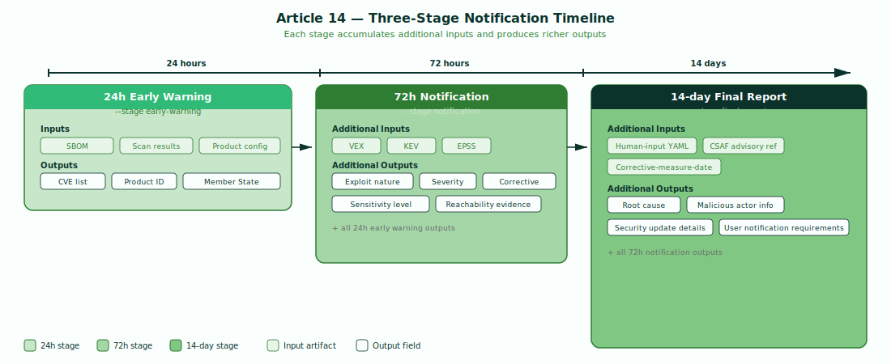

# Report - Article 14 Notification Generator

`cra report` generates CRA Article 14 vulnerability notification documents, automating the three-stage notification process required when a manufacturer becomes aware of an actively exploited vulnerability. It assembles structured data from SBOMs, scan results, VEX determinations, and exploitation signals into the format mandated by the EU Cyber Resilience Act.

!!! abstract "CRA Reference"
    This tool implements **Article 14** - Reporting obligations of manufacturers.
    It generates the three mandatory notification stages: 24h early warning (Art. 14(2)(a)),
    72h notification (Art. 14(2)(b)), and 14-day final report (Art. 14(2)(c)).
    See [Article 14 - Vulnerability Notification](../cra/article-14.md).

---

## How It Works



Article 14 defines a three-stage notification timeline. Each stage builds on the previous one, accumulating more inputs and producing richer outputs as the manufacturer gathers information about the vulnerability.

### Stage 1: 24h Early Warning

The early warning must be submitted within 24 hours of becoming aware of an actively exploited vulnerability. It requires minimal inputs - an SBOM, scan results, and product configuration - and produces a concise notification containing the CVE list, product identification, and an indication of which EU Member States are likely affected.

```bash
cra report --sbom sbom.cdx.json --scan grype.json \
  --stage early-warning --product-config product.yaml
```

### Stage 2: 72h Notification

The full notification is due within 72 hours. It incorporates VEX determinations, CISA KEV matching, and EPSS scoring to provide deeper context about the vulnerability. The output includes the nature of the exploit, severity assessments, corrective measures already taken, and a sensitivity level classification.

```bash
cra report --sbom sbom.cdx.json --scan grype.json \
  --stage notification --product-config product.yaml \
  --vex vex.json --kev kev.json --epss-path epss.json
```

### Stage 3: 14-day Final Report

The final report is due within 14 days. It requires human-supplied context such as root cause analysis and malicious actor information, a reference to the companion CSAF advisory for Art. 14(8) user notification, and the date corrective measures became available. The output is a complete document covering all fields from prior stages plus root cause, security update details, and user notification requirements.

```bash
cra report --sbom sbom.cdx.json --scan grype.json \
  --stage final-report --product-config product.yaml \
  --vex vex.json --kev kev.json --epss-path epss.json \
  --human-input human-input.yaml \
  --csaf-advisory-ref CSAF-2026-001 \
  --corrective-measure-date 2026-04-10
```

### Signal Detection

The report tool uses three signals to determine whether a vulnerability is actively exploited and to assess its severity:

**CISA KEV catalog matching** - The tool checks each CVE against the CISA Known Exploited Vulnerabilities catalog. A KEV match is a strong signal that the vulnerability is actively exploited in the wild, directly triggering Article 14 reporting obligations. The KEV catalog can be auto-fetched or provided locally via `--kev`.

**EPSS scoring** - The Exploit Prediction Scoring System provides a probability score (0.0-1.0) indicating how likely a vulnerability is to be exploited in the next 30 days. The tool applies a configurable threshold (default 0.7) - vulnerabilities scoring above this threshold are flagged as high exploitation risk. This enriches the severity assessment in the 72h notification and final report.

**VEX status** - When a VEX document is provided (from `cra vex`), the tool incorporates reachability and exploitability context. A VEX status of `affected` with high reachability confidence strengthens the exploitation signal, while `not_affected` provides evidence that reporting may not be required for that specific vulnerability.

### Reachability Evidence

When VEX data includes reachability analysis from `cra vex`, the report incorporates call path evidence showing exactly how a vulnerability is reachable from application entry points. The report renders:

- The function call chain from entry point to vulnerable code
- Confidence scores (high, medium, low) for the reachability determination
- The specific vulnerable function and the entry point that reaches it

This evidence is included in both the 72h notification and 14-day final report to help ENISA and national CSIRTs assess the actual risk posed by each vulnerability.

---

## Usage

```bash
cra report --sbom <path> --scan <path> --stage <stage> --product-config <path> [flags]
```

### Flags

| Flag | Description | Required | Default |
|---|---|---|---|
| `--sbom` | Path to SBOM file (CycloneDX or SPDX) | Yes | - |
| `--scan` | Path to scan results (Grype, Trivy, or SARIF); repeatable | Yes | - |
| `--stage` | Notification stage: `early-warning`, `notification`, `final-report` | Yes | - |
| `--product-config` | Path to product config YAML with manufacturer section | Yes | - |
| `--kev` | Path to local CISA KEV catalog JSON (auto-fetched if omitted) | No | auto-fetch |
| `--epss-path` | Path to EPSS scores JSON | No | - |
| `--epss-threshold` | EPSS score threshold for exploitation signal (0.0-1.0) | No | 0.7 |
| `--vex` | Path to VEX results (OpenVEX or CSAF VEX) | No | - |
| `--human-input` | Path to human input YAML for final report | No | - |
| `--csaf-advisory-ref` | Companion CSAF advisory ID for Art. 14(8) user notification | No | - |
| `--corrective-measure-date` | ISO 8601 date when corrective measure became available | No | - |
| `--format` | Output format: `json` or `markdown` | No | `json` |

---

## Input Formats

All input formats are auto-detected by probing JSON/YAML structure - no format flags needed.

- **SBOM:** CycloneDX (JSON), SPDX (JSON)
- **Scans:** Grype (JSON), Trivy (JSON), SARIF
- **VEX:** OpenVEX (JSON), CSAF (JSON)
- **KEV:** CISA KEV catalog JSON
- **EPSS:** EPSS scores JSON
- **Human input:** YAML with root-cause, malicious-actor, and corrective-measure fields

---

## Output Formats

- **JSON** (default) - structured Article 14 notification document, machine-readable
- **Markdown** - human-readable notification document suitable for review and submission

---

## Examples

### 24h early warning

```bash
cra report --sbom sbom.cdx.json --scan grype.json \
  --stage early-warning --product-config product.yaml \
  --format json -o early-warning.json
```

Generates the minimal early warning notification with CVE identifiers, product identification, and Member State indication. This is the first report submitted to ENISA within 24 hours of becoming aware of an actively exploited vulnerability.

### 72h notification with exploitation signals

```bash
cra report --sbom sbom.cdx.json --scan grype.json --scan trivy.json \
  --stage notification --product-config product.yaml \
  --vex vex.json --kev kev.json --epss-path epss.json \
  --epss-threshold 0.6 --format markdown -o notification.md
```

Generates the full 72h notification enriched with VEX context, KEV matches, and EPSS scores. The lowered EPSS threshold (0.6) captures more borderline exploitation signals. Multiple scan sources are merged for broader coverage.

### 14-day final report

```bash
cra report --sbom sbom.cdx.json --scan grype.json \
  --stage final-report --product-config product.yaml \
  --vex vex.json --kev kev.json --epss-path epss.json \
  --human-input human-input.yaml \
  --csaf-advisory-ref CSAF-2026-001 \
  --corrective-measure-date 2026-04-10 \
  --format json -o final-report.json
```

Generates the complete final report including root cause analysis, malicious actor assessment, security update details, and user notification requirements. The `--csaf-advisory-ref` links to the companion CSAF advisory published under Art. 14(8) for notifying product users.

---

## Integration

Report output feeds into the broader CRA compliance pipeline:

- **`cra evidence`** - Art. 14 notification documents are included in the signed evidence bundle as compliance artifacts for Annex VII technical documentation. See [Evidence - Bundling & Signing](evidence.md).
- **`cra csaf`** - Art. 14(8) requires manufacturers to inform users about the vulnerability and corrective measures. The companion CSAF advisory generated by `cra csaf` fulfills this requirement, and `--csaf-advisory-ref` links the two documents. See [CSAF - Advisory Generation](csaf.md).
- **`cra vex`** - provides the VEX determinations and reachability evidence that enrich the 72h notification and final report. See [VEX - Vulnerability Exploitability eXchange](vex.md).
