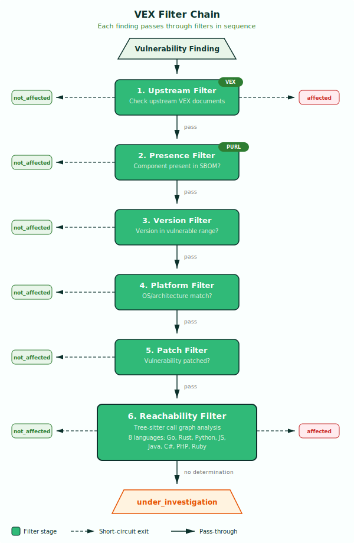

# VEX — Vulnerability Exploitability eXchange

`cra vex` is a VEX (Vulnerability Exploitability eXchange) determination pipeline that automates vulnerability exploitability assessment for software products. It takes SBOMs and vulnerability scanner output as input, applies a deterministic filter chain to each finding, and produces VEX statements communicating whether each vulnerability is applicable and why.

!!! abstract "CRA Reference"
    This tool addresses **Annex I, Part I, point 2(a)**: products with digital elements shall
    be made available on the market without known exploitable vulnerabilities.
    See [Annex I — Essential Requirements](../cra/annex-i.md).

    It also supports **Annex I, Part II**: vulnerability handling requirements including
    identification, documentation, and remediation of vulnerabilities.

---

## How It Works



Each vulnerability finding from the scanner passes through a deterministic chain of six filters, evaluated in sequence. The first filter to make a definitive determination — `not_affected` or `affected` — short-circuits the chain and that determination becomes the VEX status. If no filter makes a determination, the finding remains `under_investigation`, signalling that manual review is needed.

This design means the order of filters matters. Cheap, high-confidence checks run first (upstream vendor assessments, component presence), while expensive analysis (reachability) runs last and only for findings that could not be resolved earlier.

### Filter Details

#### 1. Upstream Filter

Checks provided upstream VEX documents for a matching vulnerability and product combination. If the upstream vendor has already assessed the vulnerability (for example, marking CVE-2024-1234 as `not_affected` because the vulnerable code path is not compiled into their distribution), that determination is used directly. This allows vendors to pre-classify vulnerabilities and have those classifications flow downstream to consumers of their software.

#### 2. Presence Filter

Verifies the vulnerable component (identified by PURL) is actually present in the SBOM. Scanners sometimes report vulnerabilities against components that are development dependencies, optional features, or otherwise not shipped in the final product. If the component is not present, the finding is marked `not_affected` with justification `component_not_present`.

#### 3. Version Filter

Checks whether the installed version of the component falls within the known vulnerable version range. If the installed version is outside the affected range — for example, the vulnerability affects versions `< 1.4.0` but version `1.5.2` is installed — the finding is marked `not_affected`.

#### 4. Platform Filter

Checks whether the vulnerability is specific to an OS or CPU architecture that does not match the product's target platform. For example, a Windows-only vulnerability does not affect a Linux container image, and an ARM-specific issue does not affect an x86_64 build.

#### 5. Patch Filter

Detects whether the vulnerability has been patched in the installed version. This covers cases where a distribution (such as SUSE) backports a security fix into an older package version. The patched package version may still fall within the nominally vulnerable range, but the vulnerability is no longer exploitable.

#### 6. Reachability Filter

Performs interprocedural call graph analysis using tree-sitter to determine whether the vulnerable function is reachable from the application's entry points. This is the most powerful filter but also the most expensive, which is why it runs last.

??? info "Reachability Analysis Details"

    **Language support:** Go, Rust, Python, JavaScript, Java, C#, PHP, Ruby (8 languages).

    **How it works:**

    - Requires the `--source-dir` flag pointing to the application source code.
    - Builds a call graph starting from entry points (main functions, HTTP handlers, exported API surfaces, etc.).
    - Traces interprocedural paths from those entry points to known vulnerable functions and methods.
    - Uses tree-sitter for language-agnostic AST parsing, enabling consistent analysis across all supported languages.

    **Confidence scores:**

    | Level | Meaning |
    |---|---|
    | `high` | Full call graph traced from entry point to vulnerable function |
    | `medium` | Partial analysis — some call edges resolved statically, others inferred |
    | `low` | Pattern match only — vulnerable function name found but call graph incomplete |

    **Call path evidence:** When a vulnerable function is found to be reachable, the exact function call chain from the application entry point to the vulnerable code is recorded. This call path evidence propagates through downstream tools — `cra report` renders it in Article 14 notifications, and `cra evidence` includes it in the compliance bundle — so reviewers can see precisely how a vulnerability is reachable.

---

## Usage

```bash
cra vex --sbom <path> --scan <path> [flags]
```

### Flags

| Flag | Description | Required | Default |
|---|---|---|---|
| `--sbom` | Path to SBOM file (CycloneDX or SPDX) | Yes | — |
| `--scan` | Path to scan results (Grype, Trivy, or SARIF); repeatable | Yes | — |
| `--upstream-vex` | Path to upstream VEX document (OpenVEX or CSAF); repeatable | No | — |
| `--source-dir` | Path to source code directory for reachability analysis | No | — |
| `--output-format` | Output format: `openvex` or `csaf` | No | `openvex` |
| `--output`, `-o` | Output file path | No | stdout |

---

## Input Formats

All input formats are auto-detected by probing JSON structure — no format flags needed.

- **SBOM:** CycloneDX (JSON), SPDX (JSON)
- **Scans:** Grype (JSON), Trivy (JSON), SARIF
- **Upstream VEX:** OpenVEX (JSON), CSAF (JSON)

---

## Output Formats

- **OpenVEX** (default) — industry standard VEX format for communicating vulnerability exploitability
- **CSAF 2.0** — structured advisory format with VEX status profile, conforming to the OASIS standard

---

## Examples

### Basic VEX determination

```bash
cra vex --sbom sbom.cdx.json --scan grype.json -o vex.json
```

Scans the SBOM against Grype findings and applies all applicable filters. Each finding passes through the filter chain — Upstream, Presence, Version, Platform, Patch — and receives a VEX status. The output is an OpenVEX document containing one statement per finding.

### With upstream VEX

```bash
cra vex --sbom sbom.cdx.json --scan grype.json \
  --upstream-vex vendor-vex.json -o vex.json
```

Upstream VEX statements are checked first by the Upstream Filter, allowing vendors to pre-classify vulnerabilities. If a vendor has already assessed CVE-2024-1234 as `not_affected`, that determination is used directly without running subsequent filters.

### With reachability analysis

```bash
cra vex --sbom sbom.cdx.json --scan trivy.json \
  --source-dir ./src --output-format csaf -o vex-csaf.json
```

Enables the Reachability Filter, which performs tree-sitter call graph analysis on the source code. Findings that pass through all other filters without a determination get reachability analysis. The output is a CSAF 2.0 advisory that includes call path evidence showing which functions lead to the vulnerable code, along with confidence scores.

---

## Integration

VEX output feeds into every downstream tool in the compliance pipeline:

- **`cra policykit`** — consumes the VEX document for VEX coverage checks (CRA-AI-2.2) and reachability quality checks (CRA-REACH-1/2/3). See [PolicyKit — Policy Evaluation](policykit.md).
- **`cra report`** — provides vulnerability context and reachability evidence for Article 14 notifications, including call path rendering. See [Report — Article 14 Notifications](report.md).
- **`cra csaf`** — enriches CSAF advisories with exploitability status from VEX determinations. See [CSAF — Advisory Generation](csaf.md).
- **`cra evidence`** — included as a VEX artifact in the signed evidence bundle for conformity assessment. See [Evidence — Bundling & Signing](evidence.md).
